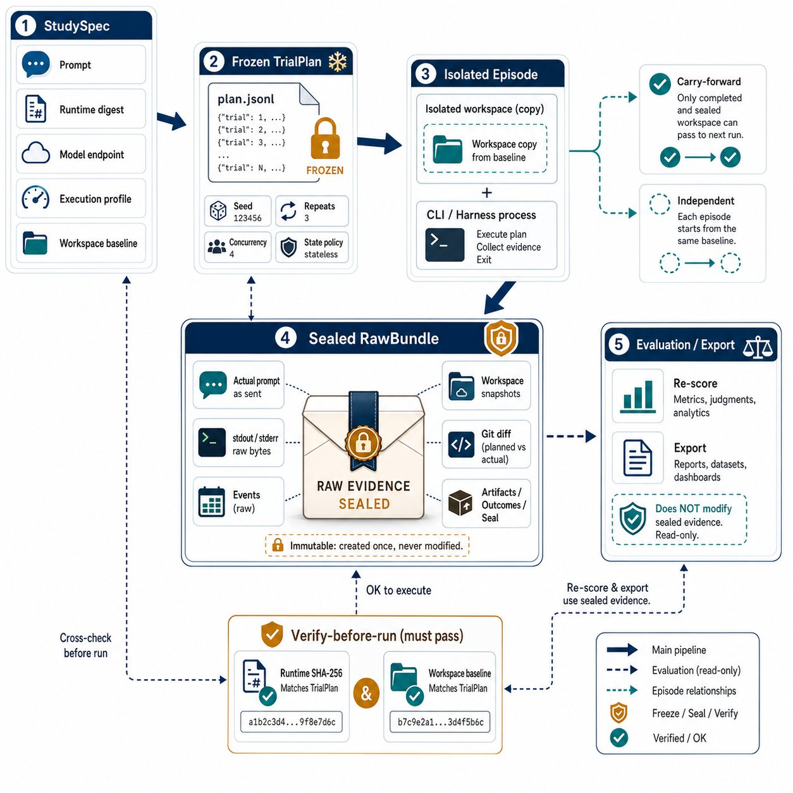

# LLM Status Machine

**把一次 LLM CLI 运行变成可以复盘、比较和核验的实验。**

当你对同一个任务反复运行 Codex、Claude Code 或自定义命令时，真正难回答的往往不是“它这次输出了什么”，而是：

- 这次与上次相比，究竟只改变了 Prompt，还是 runtime、模型、工作区也变了？
- 模型修改了哪些文件；失败或超时时，那些证据还在不在？
- 3 次连续运行是彼此独立，还是后一轮真的继承了前一轮的工作区？
- 几周后还能不能证明，当时使用的是哪一个可执行文件和哪一份输入？

LLM Status Machine（`lsm`）是一个 Python 3.12+ 本地命令行实验台。它把这些问题变成一个明确的流程：**描述实验 → 冻结执行计划 → 运行 episode → 封存原始证据 → 在证据之外评分。**

它不是聊天界面，也不是云端控制台；它面向想认真观察 LLM CLI 行为的开发者、研究者和评估工程师。

## 它解决什么问题

想象你正在比较两版任务提示词。直接在终端运行当然很快，但这会留下许多无法区分的变量：本机 `PATH` 可能指向了更新后的 CLI，工作区可能残留上次修改，控制台滚动输出也不等于可核验记录。

`lsm` 将一次完整调用定义为一个 **episode**。一个 episode 不是只有最终回答，而是一套能回看的事实：实际 Prompt、固定 runtime、stdout/stderr 原始字节、标准化事件、工作区的前后快照、Git diff、artifact、四类完成状态，以及最终的 seal（校验封条）。

因此，你既可以用它验证“同一条件下行为是否稳定”，也可以有意识地改变一个条件，观察行为如何改变。

## 与相邻工具有什么不同

它不试图取代所有评测或观测工具，而是补足 LLM CLI 实验中最容易丢失的“执行证据层”。

| 常见做法或相邻工具 | 通常擅长的事 | LLM Status Machine 特别关注的事 |
| --- | --- | --- |
| 直接调用 Codex / Claude Code | 快速完成一次任务 | 固定实际 CLI 身份、保存每次运行的原始流和工作区证据 |
| Prompt playground / 线上日志 | 对话调试与集中展示 | 本机 workspace 上的可重复 episode，记录文件改动与 Git diff |
| 指标导向的评测框架 | 批量算分、排行榜、测试集指标 | 先封存不可变 RawBundle，再允许反复更换 scorer，而不改写证据 |
| 通用流程编排器 | 调度任务 | 明确表达“并发上限”和“状态继承”这两个不同的问题 |

这意味着它尤其适合有副作用的 CLI agent：不仅关心模型说了什么，也关心它在隔离工作区里做了什么。它不提供 Web UI、HTTP API 或云端控制面，也不把 native CLI 或 `uv` 误称为安全沙箱。

## 设计上的关键取舍

### 先冻结，再运行

你写的是 `StudySpec`（YAML 实验说明），但 runner 执行的是编译出的 JSONL `TrialPlan`。编译时会：

- 渲染 Prompt，计算其摘要；
- 扫描 source workspace，固定 baseline manifest；
- 展开因素、重复和实验设计，并以 seed 稳定排序；
- 写入绝对 runtime 路径、版本信息和 SHA-256。

执行时不会重新读取 `latest`、依赖宿主 `PATH` 或临时扩展实验矩阵；它会再次校验 runtime digest 与 workspace baseline。这样“计划的是哪次实验”和“实际跑的是哪次实验”可以对上。

### 把并发和状态拆开

很多工具把“串行”同时当作调度策略和数据依赖，容易造成歧义。`lsm` 用两个独立字段表达：

| `state_policy` | 工作区关系 | 与 `concurrency` 的关系 |
| --- | --- | --- |
| `independent`（默认） | 每个 episode 都从同一 frozen baseline 复制 | 可使用有界并发 |
| `carry_forward` | 下一轮只继承上一轮已完成且已 seal 的 workspace | 必须为 `1` |
| `branch` | 每个分支仍从共同 baseline 开始，保留分支语义 | 可使用有界并发 |

因此，“并发 8 个独立样本”和“连续 3 轮让 agent 接着改同一个项目”是两个清楚、可验证的实验，不是同一个模糊的 `serial` 开关。

### 原始证据优先于漂亮的解析结果

stdout/stderr 会先逐字节写入 raw 文件，再增量解析成 transcript。未知厂商事件、无效 UTF-8、半行 JSON 或解析失败都不会被悄悄丢掉：解析层会标记问题，原始字节仍保留。由于两个 OS pipe 没有可靠的全局顺序，记录也不会假装恢复一个不存在的“真实混合输出顺序”。

每个 attempt 都会得到 process、protocol、capture、workspace 四类 outcome。只有它们都满足约束，episode 才会是 `completed`。无论成功、失败还是超时，runner 都会尽力捕获最终工作区并 seal 已有证据。

### 保护被测工作区，也保护评分独立性

source workspace 从不直接执行；每个 episode 在独立副本中初始化 Git snapshot。评分结果写入 `evaluations/`，不修改 sealed RawBundle。这样你可以升级评分规则、重跑评估，仍保留当时原始运行的证据。

## 快速开始：先跑一个无需密钥的实验

前置条件：Python 3.12+、[uv](https://docs.astral.sh/uv/) 和 Git。以下命令使用内置 Simulator；它会在本地模拟一个会产生事件、artifact 和文件修改的 agent，因此不需要模型密钥。

```bash
uv sync --frozen --extra test

# 初始化一个独立实验目录；会生成 .lsm/ 和 study.example.yml。
uv run lsm init tmp/quickstart

# 先确认 StudySpec 有效，再将它冻结为可执行计划。
uv run lsm study validate tmp/quickstart/study.example.yml --json
uv run lsm study compile \
  tmp/quickstart/study.example.yml \
  tmp/quickstart/.lsm/plans/first-plan.jsonl --json

# 执行冻结计划；输出中的 id 是本次 run ID，episodes 是 episode ID 列表。
uv run lsm run start \
  tmp/quickstart/.lsm/plans/first-plan.jsonl \
  --data-root tmp/quickstart/.lsm --json
```

初始化生成的样例会以 `concurrency: 1` 和 `state_policy: carry_forward` 运行 3 次，默认 Prompt 为“请以‘新中国的美人’为题写一首七言绝句。”。因此，第二、三次都会基于前一个已完成 episode 的 workspace，而不是重新使用原始目录。

运行完成后，用上一步 JSON 中的实际 ID 查看和核验结果：

```bash
uv run lsm run status <run-id> --data-root tmp/quickstart/.lsm --json
uv run lsm episode validate <episode-id> --data-root tmp/quickstart/.lsm --json
uv run lsm episode events <episode-id> --data-root tmp/quickstart/.lsm
uv run lsm episode diff <episode-id> --data-root tmp/quickstart/.lsm
```

`episode validate` 会验证 seal；通过后才说明 RawBundle 中被封存的文件仍与记录的摘要一致。`events` 展示解析后的 transcript；需要看严格的进程输出时，使用 `episode stdout`，而不是把 transcript 当成原始 stdout 的替代品。

也可以一条命令运行项目的核心验收：

```bash
uv run lsm smoke --root tmp/core-smoke-manual --json
```

它会用 Simulator 完成 3 个连续、carry-forward 的 episode，并写入完整记录。`--root` 必须是一个尚不存在的目录。

## 一次实验从配置到证据的过程

```text
StudySpec (YAML)
       │ validate / compile
       ▼
冻结的 TrialPlan（JSONL：一个计划头和确定的 trial）
       │ run start：复核 runtime 与 baseline
       ▼
Run ──► Episode ──► Attempt ──► sealed RawBundle
                                      │
                                      └──► evaluation（位于 bundle 外）
```



*原理图：实验条件先冻结并在执行前复核；工作区与原始证据被隔离封存，评分与导出不改写 RawBundle。*

一个 `StudySpec` 将本来容易混在一起的条件分开：

- `prompts`：可版本化 Prompt revision，以及变量；
- `workspace`：被测目录及其排除项；
- `runtime`：实际 harness 可执行文件、版本、平台和 SHA-256；
- `endpoint`：模型 ID、提供方、可选 base URL 与凭据引用；
- `profile`：超时、网络、权限、允许继承的环境变量名、解码方式等；
- `factors` / `design`：全因子、配对或 block 条件；
- `repeats`、`concurrency`、`state_policy`：样本数、调度与工作区拓扑。

最小配置来自 `lsm init` 生成的 `study.example.yml`。下面这个节选展示了最重要的可控变量；路径必须是绝对路径，因为它们会成为实验身份的一部分。

```yaml
schema_version: 1
name: prompt-comparison
seed: 42
repeats: 3
concurrency: 2
state_policy: independent
design: full_factorial
prompts:
  - id: concise
    body: 请简洁地修复测试失败。
  - id: explanatory
    body: 请修复测试失败，并说明修改原因。
factors:
  review_mode: [false, true]
workspace:
  path: /absolute/path/to/workspace
runtime: # 由 lsm harness lock 生成并填入完整对象
  provider: managed
  surface: codex_exec_cli
  requested: 0.144.0
  version: 0.144.0
  executable: /absolute/path/to/codex
  sha256: <frozen-executable-digest>
  platform: darwin-arm64
  version_output: <recorded-version-output>
endpoint:
  provider: openai
  model_id: <model-id>
profile:
  timeout_seconds: 300
  env_allowlist: [OPENAI_API_KEY]
```

上述配置会生成 `2 prompts × 2 factor levels × 3 repeats = 12` 个 trial；`seed` 只决定这 12 个 trial 的稳定顺序。若要让下一轮继承上一轮工作区，把 `state_policy` 改为 `carry_forward`，同时把 `concurrency` 设为 `1`。

## 接入真实 CLI runtime

先锁定你准备使用的二进制。这里的路径请替换成机器上的实际绝对路径：

```bash
uv run lsm harness probe /absolute/path/to/codex --json
uv run lsm harness lock \
  --surface codex_exec_cli \
  --executable /absolute/path/to/codex \
  --version 0.144.0 \
  --output .lsm/codex-0.144.0.json
```

将生成 JSON 的完整对象填入 StudySpec 的 `runtime` 字段，再编译计划。内置 adapter 包括：

- `simulator`：本地验收与 recorder 测试；
- `codex_exec_cli`：固定 Codex `exec --json` 调用；
- `claude_print_cli`：固定 Claude Code `-p --output-format stream-json` 调用；
- `custom_command`：声明式 argv 数组，适用于其他 CLI。

自定义命令不接受 shell 模板；首个 argv 必须是已冻结的 runtime executable，shell、`env` 等分派器会被拒绝。模型凭据只通过 `profile.env_allowlist` 指定环境变量**名称**；计划、launch metadata 和日志不会保存其值。请仍然注意：模型输出本身可能含敏感内容，`.lsm/` 的访问权限和保留周期由你负责。

## 结果在哪里，怎样阅读

每次 run 都是自描述的；SQLite 只是查询索引，文件系统中的 manifest 和 bundle 才是事实来源。

```text
.lsm/
  index.sqlite3                 # 可由文件记录重建的 WAL 索引
  plans/
    first-plan.jsonl
  runs/<run-id>/
    run.json
    episodes/<episode-id>/
      episode.json
      workspace/                # 该 episode 实际执行的副本
      attempts/attempt-1/raw-bundle/
        prompt.md               # 实际发送的 Prompt
        trial.json / runtime.json / launch.json
        stdout.raw / stderr.raw  # 原始字节，未经“美化”
        transcript.jsonl         # 解析与规范化后的事件
        workspace.initial.json / workspace.final.json
        changed-files.json / diff.patch
        artifacts.json / artifacts/
        outcomes.json
        metadata.json
        seal.json
      evaluations/              # 重评分结果，不写回 RawBundle
```

常用的后续操作：

```bash
# 在不触碰原始 bundle 的情况下评分。
uv run lsm evaluate episode <episode-id> --data-root .lsm --json

# 即使删除了索引，也可从 run/episode manifest 重建或校验。
uv run lsm store reindex --data-root .lsm --json
uv run lsm store verify --data-root .lsm --json

# 导出某次 run；format 可为 archive、jsonl 或 csv。
uv run lsm export run <run-id> result.tar.gz --data-root .lsm --format archive
```

如果进程意外中断，`lsm run reconcile` 会把仍为 `running` 的 run 标记为 `orphaned`，不会猜测它已成功完成。

## 安全和边界

- `.lsm/` 的 RawBundle 可能包含 Prompt、模型输出和工作区内容；把它当作本地实验数据管理。
- LSM 隔离 source workspace 与 episode 副本，但 native runtime、`uv` 和 CLI 自带 sandbox 都不等于完整安全隔离。需要强隔离时，请自行控制用户、挂载、网络、权限和资源。
- 对于超时，POSIX 会先终止独立进程组，宽限后再强杀；即使失败也会尝试封存已有证据。
- 旧 Node/Web 版本的数据只读导入，不做就地升级或双写。迁移流程见 [迁移指南](docs/migration-from-node.md)。

## 开发与验证

```bash
make sync
make test
make smoke
make build
```

应用版本只在 [`src/llm_status_machine/version.py`](src/llm_status_machine/version.py) 维护；RawBundle schema version 与应用版本彼此独立。实现细节可继续阅读 [工作过程说明](docs/how-it-works.md) 和 [Python CLI 核心 ADR](docs/adr/0001-python-cli-core.md)。
