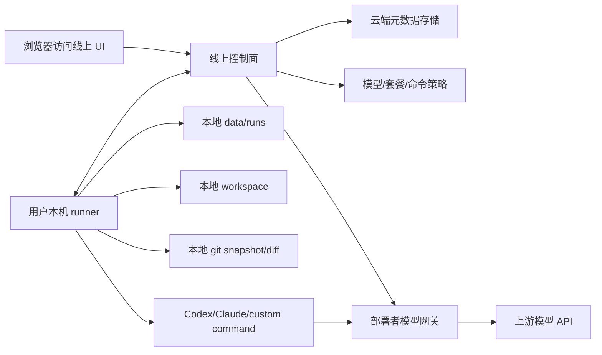

# 线上控制面、本地执行面与指定 API 算力可行性分析

本文基于当前源码讨论一个产品问题：

- 业务逻辑是否可以部署在线上，用户访问一个网址使用应用。
- 用户是否仍能用它处理本地项目、数据、文件，且原始文件和完整运行产物默认不上云。
- 模型调用是否可以强制使用服务部署者指定的 API 算力。

结论：可以，但这不是把当前应用直接部署到公网就能得到的形态。当前实现是“本地或自托管的一体化实验台”：HTTP API、前端、存储、队列、runner 和 workspace 访问权在同一个部署边界内。要满足上述三点，需要把系统拆成线上控制面、本地 runner、部署者模型网关三个边界，并调整当前 DevTools、Model、runner 和结果读取协议。

## 当前代码的真实边界

当前项目的主链路在 `server/index.js`、`server/runner.js`、`server/store.js`、`server/storage/*` 和 `src/main.jsx` 中。

用户在前端创建 Prompt、Model、Workspace，然后通过 `POST /api/runs` 启动 run。`startRun` 会创建 run 记录并通过队列提交 `{ runId }`。本地开发默认 `QUEUE_DRIVER=inline`，生产 Docker 可以用 Redis 队列和独立 worker，但无论 inline 还是 worker，最终都进入 `processRunJob` 和 `runSession`。

`runSession` 当前直接做这些事情：

- 从 Workspace state 读取本机或容器内可见的目录。
- 把 workspace 复制到 `data/runs/<run-id>/state-N/workspace`。
- 在隔离 workspace 里初始化 git，提交初始快照。
- 写入 `prompt.txt`。
- 渲染 `environment.commandTemplate`，通过 `spawn(..., shell: true)` 启动 Codex、Claude Code 或自定义命令。
- 收集 stdout、stderr、事件流，写入 `transcript.ndjson`、`stdout.txt`、`stderr.txt`。
- 执行后提交 git 快照，生成 `diff.patch`、`metadata.json`、changed files、diff stat 和 artifact 列表。

这说明当前“API 服务”本身就是执行面。只要把它部署到云服务器，云服务器就会成为 workspace 访问者和命令执行者；用户浏览器本地的项目目录不会自然可见。Docker 里的 `WORKSPACES_MOUNT` / `WORKSPACES_TARGET` 只是把宿主机目录挂进容器，解决的是本机或自托管机器上的路径映射，不是公网 SaaS 访问用户电脑。

## 当前实现已经具备的有利条件

虽然当前不是 SaaS + 本地 runner 架构，但它已经有一些可以复用的构件。

Run/session 数据模型比较清楚。Run 负责一次批量实验，Session 负责一次实际客户端调用，session 里已有 workspace、command、events、changedFiles、diffStat、artifacts、exitCode、timeout 等字段。这些字段天然适合拆成“线上控制面只存索引，本地 runner 存完整文件”的协议。

串行和并行计划已经独立在 `createExecutionPlan` 中。它只关心 prompt 展开、sequence、iteration、sourceWorkspace 和 outputLabel。未来即使 runner 外置，执行计划也可以由控制面生成后下发，或由本地 runner 根据控制面配置生成。

存储层已有 file/Postgres 两种模式。控制面的 metadata 可以继续放 Postgres；本地 runner 的完整 run files 可以继续用当前 `data/runs` 结构保存。两者不必使用同一个存储后端。

DevTools 已有 API key、连接、心跳、终止请求、外部工具读取 context、启动 runs、写 session events/artifacts 的基础概念。这可以演进成本地 runner 注册和心跳机制。

事件流已有内存/Redis event bus。线上控制面可以继续用事件向浏览器刷新状态；本地 runner 则需要把事件摘要或状态增量上报给控制面。

## 当前实现不满足目标的地方

第一，线上部署后无法处理用户本地文件。当前 Workspace state 保存的是 API/worker 所在机器能访问的绝对路径。`validateWorkspaceFolders` 也在 API 侧做 `fs.stat`。如果 API 在云端，用户输入 `/Users/alice/project` 没有意义，云端无法访问这个路径。

第二，当前 API 会读取并返回完整运行产物。`/api/sessions/:id/diff` 读取 `diff.patch`，`/api/sessions/:id/transcript` 读取 `transcript.ndjson`，artifact 接口直接 `sendFile`。DevTools 也有对应的 diff/transcript/artifact 读取接口。在“文件不上云”的目标下，这些接口不能由线上控制面直接读取本地 run 文件。

第三，当前 Model 仍是用户可配置执行环境。前端 `blankEnv` 包含 `envVars`，seed environment 也有 `envVars`，runner 会把 `environment.envVars` 注入子进程环境，还会把完整 `environment` 写入 `metadata.json`。README 也仍说明 custom environment variables can be stored。这意味着当前实现允许用户通过 Model 配置影响 base URL、command template 和环境变量。它不等于“必须使用服务部署者指定 API 算力”。

第四，当前 DevTools 是外部可信工具入口，不是本地 runner 协议。它能连接、心跳、启动 run、读上下文、写事件和 artifact，但它没有任务认领、runner 本地路径授权、本地结果保留策略、内容上传开关、模型网关短期凭证下发等语义。

第五，当前安全边界偏本地工具，而不是公网多租户 SaaS。主 API 没有面向普通用户的账号体系；DevTools admin 默认限制本机或显式放开；directory picker 也是 API host 本机动作。这些设计适合本地实验台，不适合直接暴露给远程用户。

## 能否只用线上网页实现

不能完整实现。

浏览器可以在某些环境下通过 File System Access API 读写用户选择的目录，但这不足以替代当前 runner。当前项目需要启动本地命令、复制多目录 workspace、初始化 git、生成 diff、保存 stdout/stderr/transcript/artifact、支持串行三次以上的状态传递和长时间任务。普通网页受浏览器沙箱限制，不能可靠执行 `codex exec`、`claude -p`、`git` 或任意 shell command。

因此，如果目标仍是“像真实用户发起任务一样调用 Codex、Claude Code 或自定义命令”，必须有本地执行组件。线上网页可以是控制台，但不能是唯一执行器。

## 可行的目标架构

推荐拆成三个平面。

线上控制面负责：

- 用户、组织、登录态、套餐、额度和权限。
- Prompt、实验模板、运行参数和模型 profile。
- Run/session 的索引状态，例如 queued、claimed、running、completed、failed。
- runner 注册、心跳、版本、在线状态和终止请求。
- 部署者 API 网关的短期凭证签发。
- 可选的脱敏摘要、指标、耗时、token 用量和错误码。

本地 runner 负责：

- 管理本机 workspace 授权和路径。
- 执行当前 `runSession` 的核心逻辑：复制 workspace、运行命令、记录 transcript、生成 git snapshot 和 diff。
- 把完整 `data/runs/<run-id>/state-N/` 留在本机。
- 只向控制面上报默认安全的状态与指标。
- 在用户显式授权时，才上传 diff、transcript、artifact 或文件片段。

部署者模型网关负责：

- 持有上游 provider key。
- 暴露 OpenAI/Anthropic 兼容 endpoint 或专用 endpoint。
- 校验 runner/session 短期 token。
- 限制模型、base URL、reasoning effort、并发和上下文上限。
- 统计用量、成本、错误和限流。

## 对当前代码的最小改造路径

第一步，收敛 Model 的含义。当前 Model 是可编辑的执行环境，包含 client、model、baseUrl、reasoningEffort、commandTemplate、timeoutMs、envVars。若要强制部署者算力，云端版本里 Model 应改为服务端 policy profile：用户只能选择被授权的 profile，不能任意提交 base URL、envVars 或 commandTemplate。runner 启动客户端时由控制面下发经过签名的 profile 和短期网关凭证。

第二步，拆 runner。把 `server/runner.js` 中真正接触文件系统和 spawn 的部分抽成可独立运行的本地 runner 包。云端 API 不再直接调用 `copyWorkspace`、`initRepo`、`spawn` 或读取 `data/runs` 文件。云端只创建 run、保存任务、等待 runner 认领并上报状态。

第三步，改 Workspace state。云端不应该对用户本地绝对路径做 `fs.stat`。路径验证应移到本地 runner。控制面只保存 workspace alias、runner id、用户可见名称和可选描述。本地 runner 保存 alias 到真实路径的映射。

第四步，重新定义 session 产物读取。当前 `/api/sessions/:id/diff`、`/transcript`、`/artifacts/:name` 适合本地一体化部署；云端控制面应默认返回“内容在本地 runner 上”。如果浏览器要查看详情，可以走两种路线：浏览器直连本机 runner 的 localhost API；或用户点击上传后，runner 把指定产物上传到云端临时对象存储。

第五步，把 DevTools 扩展成 Runner API。现有 connect/heartbeat/terminate 可以保留，但需要新增任务认领和状态上报语义，例如 `GET /runner/jobs/next`、`POST /runner/jobs/:id/events`、`POST /runner/jobs/:id/complete`。同时需要 runner 能力声明，例如支持的客户端、平台、工作目录根、版本、是否允许内容上传。

第六步，加入模型网关。当前 runner 直接把 `environment.baseUrl` 导出为 `OPENAI_BASE_URL` 和 `ANTHROPIC_BASE_URL`，还允许 envVars 覆盖。目标架构里应由控制面给每个 session 签发短期 token，并强制 base URL 指向部署者网关。上游 provider key 永远不进入前端、runner 配置、session metadata 或 transcript。

第七步，定义隐私策略。当前应用完整记录 stdout、stderr、transcript、diff 和 artifact，这非常适合本地评估，但不适合默认上传。云端版应把这些内容分级：状态和指标默认上传；路径列表和 diff stat 可配置上传；全文内容必须显式授权。

## 指定 API 算力的边界

在平台内强制使用指定 API 算力是可行的，但它的强制力来自服务端网关，而不是本地 runner 本身。

可行机制是：

- 用户在云端选择一个 model profile。
- 控制面检查套餐、额度和策略。
- 控制面给某个 run/session 签发短期 token。
- runner 启动客户端时只注入部署者网关 base URL 和短期 token。
- 网关验证 token 绑定的用户、runner、run、session、model profile 和有效期。
- 网关转发请求并记录用量。

需要接受的现实是：runner 运行在用户机器上，用户理论上能修改本地程序或在产品之外直接运行其它工具。平台能保证的是“通过本产品创建、记录和计费的任务必须走指定网关”，不能阻止用户绕开产品用自己的 key 处理同一个本地目录。

对于 Codex CLI、Claude Code 这类外部客户端，还要确认它们是否支持自定义 base URL 和临时 token。如果不支持，就不能简单通过环境变量强制路由，需要包装脚本、兼容代理、专用 adapter，或限制云端版只支持可被网关控制的客户端。

## “完全不上云”的准确含义

这里必须非常谨慎。

如果使用部署者指定的远程 API 算力，模型输入必然会离开本机，至少会经过部署者网关，并可能继续到上游模型供应商。即使控制面不保存文件，发送给模型的 prompt、上下文、代码片段、错误日志或 diff 片段仍然属于离开本机的数据。

因此，若仍使用远程 API 模型，准确表述应是：

> 本地项目文件、完整运行目录、stdout/stderr、transcript、diff 和 artifact 默认只保存在用户本机；平台控制面只接收运行状态和必要指标；被任务实际发送给模型的上下文会通过部署者指定 API 网关处理。

只有在模型也部署在本机或企业内网时，才能更严格地说“执行和推理都不上公网云”。

## 三种可支持的部署形态

本地一体化模式是当前项目已经实现的形态。前端、API、runner、存储和 workspace 访问都在本机或同一台自托管机器上。优点是简单、隐私边界清楚、完整产物都在本地。缺点是没有 SaaS 账号、统一套餐和部署者算力强制能力。

自托管服务器模式也是当前 Docker 方案接近支持的形态。用户或团队把 app、worker、Postgres、Redis 部署在自己的服务器上，通过 volume mount 暴露 workspace。它适合内网实验台，但仍要求服务器能访问 workspace。它不是“访问公网网址处理用户笔记本本地项目”。

线上控制面 + 本地 runner 模式是满足本问题三项条件的目标形态。它需要新增 runner 协议、模型网关、权限系统和内容上传策略。当前代码能提供核心执行逻辑和数据模型基础，但还没有完成这个架构拆分。

## 推荐结论

有可能，而且值得作为后续产品方向。但基于当前代码，不能把它描述成“已经支持把业务逻辑放线上，同时用户本地文件完全不上云，并强制使用部署者 API 算力”。当前项目支持的是本地/自托管的一体化行为实验台。

要达到目标，最小可行产品应是：

- 云端控制面管理用户、Prompt、实验配置、model profile、额度和 run 索引。
- 本地 runner 复用当前 `runSession` 能力，保存完整运行产物。
- 云端不直接读取本地 workspace，也不默认保存 transcript、diff、artifact。
- 模型请求统一走部署者 API 网关，runner 只拿短期 session token。
- DevTools 从外部工具 API 演进为正式 runner API。

这样的设计可以同时满足“线上业务逻辑”“本地文件处理”“指定 API 算力”。但产品文案应避免绝对化的“整个过程完全不上云”：如果模型使用远程 API，模型上下文会离开本机；真正默认不上云的是本地文件系统和完整行为记录。
