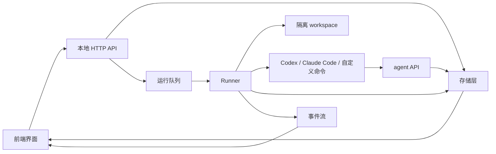
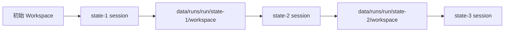
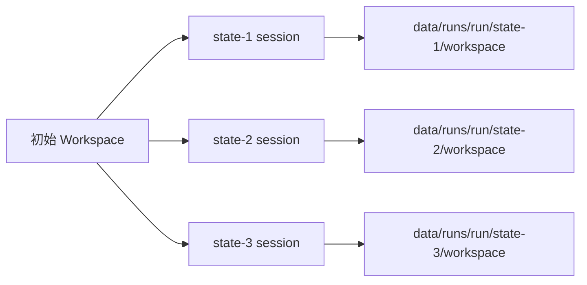
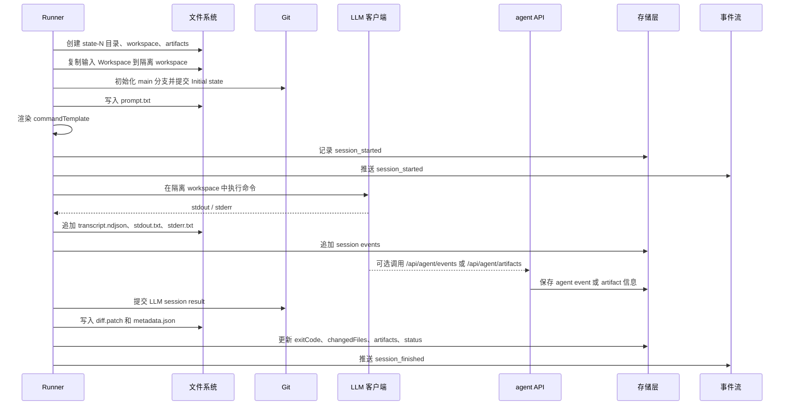

# LLM Status Machine 工作过程

本文说明本应用从配置实验、启动运行、调用 LLM 客户端到保存结果的完整过程。它面向需要理解系统行为的使用者和维护者，重点解释运行链路，而不是安装步骤。

## 核心概念

- Prompt：可复用任务说明。每个 prompt 在实验中可以设置重复次数。
- Model：LLM 客户端环境配置，包括客户端类型、模型名、base URL、命令模板、超时和环境变量。
- Workspace：一次实验的初始工作状态，通常是一个本地项目目录。
- Run：用户点击 Start 后创建的一批实验任务。
- Session：Run 中的一次实际客户端调用。一个 prompt 重复 3 次会生成 3 个 session。
- Artifact：运行中的客户端额外写入的产物，例如报告、JSON 结果或截图索引。
- Transcript：session 的事件流水，记录生命周期事件、stdout、stderr 和客户端主动上报的结构化事件。

## 总览

应用由前端、HTTP API、存储层、队列/worker、runner 和被调用的 LLM 客户端组成。前端负责配置与展示，API 负责持久化和调度，runner 负责复制 workspace、执行命令、记录事件和生成 diff。



## 配置阶段

用户通常先在界面中准备三类基础配置：

- 在 Prompts 中维护任务文本，例如代码审查、修复主要问题或生成报告。
- 在 Models 中维护客户端执行环境，例如 `codex exec ...`、`claude -p ...` 或 `node {simulator} {promptFile}`。
- 在 Workspace 中登记本地目录。目录可以手动输入，也可以通过本地目录选择器添加。

这些配置通过 `/api/prompts`、`/api/environments` 和 `/api/states` 写入存储层。默认文件存储模式会写入 `data/store.json`；Postgres 模式会把元数据写入数据库。

## 启动 Run

在 Experiment 页面中，用户选择一个 Model、一个 Workspace、一个或多个 Prompt，并为每个 Prompt 设置重复次数，然后选择 `serial` 或 `parallel` 流程并启动。

前端会向 `/api/runs` 发送类似下面的配置：

```json
{
  "stateId": "state-buggy-js",
  "environmentId": "env-dry-run",
  "mode": "serial",
  "promptRuns": [
    { "promptId": "prompt-review", "count": 2 }
  ]
}
```

API 收到请求后会：

- 校验 Workspace、Model 和 Prompt 是否存在。
- 创建一个状态为 `running` 的 run 记录。
- 将 `{ runId }` 放入运行队列。
- 立即返回 run，让前端可以进入查看状态。

本地开发默认使用 inline 队列，在 API 进程内异步执行；多进程部署可使用 Redis 队列，由独立 worker 进程消费任务。

## 生成执行计划

运行处理器取到 run 后会读取最新的 Workspace、Model 和 Prompt 配置，并展开为 session 执行计划。执行计划只决定每个 session 的输入 workspace、输出标签和顺序，真正的目录复制与命令执行在 session 阶段发生。

串行模式会把上一个 session 的输出作为下一个 session 的输入：



并行模式会让每个 session 都从同一个初始 Workspace 独立复制：



## 执行 Session

每个 session 会在 `data/runs/<run-id>/state-N/` 下创建独立运行目录，并在其中保存 workspace、日志、metadata、diff 和 artifacts。

单个 session 的执行过程如下：



命令模板支持占位符，例如：

- `{prompt}`：经过 shell escape 的 prompt 文本。
- `{promptRaw}`：原始 prompt 文本。
- `{promptFile}`：包含 prompt 文本的文件路径。
- `{model}`：Model 中配置的模型名。
- `{baseUrl}`：Model 中配置的 base URL。
- `{reasoningEffort}`：Model 中配置的思考强度。
- `{workspace}`：当前 session 的隔离 workspace。
- `{simulator}`：内置 dry-run 模拟器路径。

执行客户端时，runner 会注入一组环境变量，方便客户端知道自己处于哪次实验中：

- `LLM_STATUS_MACHINE_API`
- `LLM_STATUS_MACHINE_RUN_ID`
- `LLM_STATUS_MACHINE_SESSION_ID`
- `LLM_STATUS_MACHINE_BRANCH`
- `LLM_STATUS_MACHINE_WORKSPACE`
- `LLM_STATUS_MACHINE_ARTIFACTS_DIR`

如果 Model 配置了 `baseUrl`，runner 还会导出 `OPENAI_BASE_URL` 和 `ANTHROPIC_BASE_URL`。如果配置了 `reasoningEffort`，会导出 `LLM_REASONING_EFFORT`。

## 结果记录

每个 session 的主要输出保存在：

```text
data/runs/<run-id>/state-N/
  workspace/
  prompt.txt
  metadata.json
  transcript.ndjson
  stdout.txt
  stderr.txt
  diff.patch
  artifacts/
```

其中：

- `workspace/` 是本次 session 的最终工作区快照。
- `metadata.json` 保存 prompt、environment、state、branch、source workspace 和输出标签。
- `transcript.ndjson` 保存完整事件流水，每行一个 JSON 事件。
- `stdout.txt` 和 `stderr.txt` 保存子进程原始输出流。
- `diff.patch` 保存从初始提交到结果提交之间的补丁。
- `artifacts/` 保存客户端通过 API 或直接写目录生成的补充产物。

runner 会在隔离 workspace 内创建 git 仓库，固定使用 `main` 分支：

- 执行前提交 `Initial state`，得到 `initialCommit`。
- 执行后提交 `LLM session result`，得到 `finalCommit`。
- 如果文件发生变化，记录 `changedFiles`、`diffStat` 和 `diff.patch`。

## 事件与前端刷新

运行中产生的事件会进入两条观察路径：

- 持久化路径：事件写入 session 的 `transcript.ndjson`，并同步追加到存储层的 session events。
- 实时路径：事件通过 `/api/events` 推送给前端，前端在 Stream 面板展示最近事件。

前端还会定时刷新 `/api/store`，因此即使错过某个实时事件，也会通过持久化状态看到 run 和 session 的最新结果。选中某个 session 时，前端会额外读取：

- `/api/sessions/:id/diff`
- `/api/sessions/:id/transcript`
- `/api/sessions/:id/artifacts/:name`

## 客户端主动上报

被调用的 Codex、Claude Code 或自定义命令可以通过环境变量拿到当前 run/session 信息，然后调用本地 API 上报更细的行为记录。

写入结构化事件：

```bash
curl -X POST "$LLM_STATUS_MACHINE_API/api/agent/events" \
  -H 'content-type: application/json' \
  -d '{
    "runId": "'"$LLM_STATUS_MACHINE_RUN_ID"'",
    "sessionId": "'"$LLM_STATUS_MACHINE_SESSION_ID"'",
    "type": "assistant_note",
    "payload": "发现测试失败，准备定位原因。"
  }'
```

写入 artifact：

```bash
curl -X POST "$LLM_STATUS_MACHINE_API/api/agent/artifacts" \
  -H 'content-type: application/json' \
  -d '{
    "runId": "'"$LLM_STATUS_MACHINE_RUN_ID"'",
    "sessionId": "'"$LLM_STATUS_MACHINE_SESSION_ID"'",
    "name": "notes.md",
    "content": "本轮运行的额外观察记录。"
  }'
```

artifact 文件名会被清理为安全的 basename，写入当前 session 的 `artifacts/` 目录。

## 存储与部署模式

应用支持两种常见运行形态：

- 单进程本地模式：`STORAGE_DRIVER=file`、`QUEUE_DRIVER=inline`、`EVENT_BUS=memory`。API 进程直接保存 JSON 文件并异步执行 run。
- 多进程部署模式：`STORAGE_DRIVER=postgres`、`QUEUE_DRIVER=redis`、`EVENT_BUS=redis`。API 负责接收请求，worker 消费队列，Postgres 保存元数据，Redis 负责队列和事件广播。

无论使用哪种元数据存储模式，大文件和运行产物仍然保存在 `data/runs` 下，便于直接检查和归档。

## 失败处理

session 失败通常来自命令非零退出、超时、目录复制失败、git 操作失败或客户端运行异常。runner 会尽量保留已经产生的 transcript、stdout、stderr 和错误事件，并把 session 标记为 `failed`。

run 完成时会检查所有 session：

- 如果任一 session 为 `failed`，run 标记为 `failed`。
- 如果全部 session 正常完成，run 标记为 `completed`。

这种设计让失败本身也成为实验记录的一部分，方便比较不同模型、命令模板或 workspace 状态下的行为差异。
