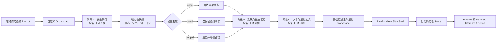

# 错误先验洗脱、记忆中介与证据门控实验设计

## 文档状态

- **状态：** Proposed
- **目标目录：** `examples/prior-washout-evidence-gating-study/`
- **研究性质：** 先探索性 pilot，冻结后进入确认性研究
- **主要对象：** LLM CLI、Prompt revision、Harness、持久工作区、确定性证据与盲化评分构成的完整 Agent 系统
- **本计划边界：** 只设计实验与实现路线，不在本轮创建实验 fixture、调用真实模型或产生研究结论

## 结论先行

本项目最适合新增的旗舰实验不是普通 Prompt A/B，也不是直接把多个 `carry_forward` episode 当作独立样本，而是一个具有确定性科学真值的三阶段因果实验：先用可信但错误的科学先验诱导 Agentic 符号回归，再在全新模型上下文中撤除该先验，通过开放记忆、证据门控和完全清空三种状态制度观察恢复轨迹，最后使用模型不可见的结构真值与封存 OOD 数据盲化评分。

该设计同时检验两个层面：科学上回答错误 Prompt 是否会通过持久状态产生路径依赖；工程上验证 LLM Status Machine 能否冻结实验条件、运行组合 Harness、完整记录跨阶段证据、保留失败、从 sealed commit 评分并形成有效的 episode 级推断。

## 为什么不能直接沿用 carry-forward 对照

上一版“连续改进与路径依赖”方向适合作为功能演示，但不能直接承担确认性主研究，原因来自当前项目契约：

- `StudySpec` 的确认性模式要求 `state_policy=independent` 和 `concurrency=1`。
- 项目规定 episode 是唯一随机化和推断单位；连续继承的多个 episode 相关，不能被当作独立样本。
- `carry_forward` 在一次 plan 内形成一条连续父链，当前没有“多条独立 chain/cluster”及其层级推断语义。
- 研究层的 contrast 以 Prompt arm 为处理变量，不支持跨 run 的 state-policy 确认性比较。

因此，本计划把诱导、洗脱和恢复封装为同一个 episode 内的三个模型进程。每个 episode 从相同 frozen baseline 独立开始，既获得真正的新鲜上下文，又保留一条完整轨迹作为统计单位。

## 从相关论文吸收的实验原则

用户提供的深度报道覆盖了 Prompt 搜索、反思、显式搜索、多 Agent、Harness 进化与 Agentic 符号回归。对本项目最有用的不是复制某篇论文的榜单，而是组合以下方法学：

| 研究路线 | 可复用的实验原则 | 本计划中的实现 |
| --- | --- | --- |
| APE、OPRO | 把指令作为受控变量，用可重算目标反馈优化 | Prompt revisions 是唯一处理变量；可见评估器提供受限反馈 |
| Reflexion、Self-Refine、FLARE | 让失败反馈进入下一轮，同时保留阴性结果 | 阶段轨迹写入持久状态；失败 episode 不从分析删除 |
| Tree of Thoughts | 测量候选搜索、分叉、回溯和计算开销 | 标准化候选 JSONL，记录父候选、函数族、分数与失败类型 |
| A-SR | 依失败类型路由证据；用可执行公式真值约束生成 | 证据门控只保留外部验证事实；确定性表达式执行与结构评分 |
| LongHorizon-Harness | 新鲜上下文、执行与审计分权、只有证据能升级状态 | 三次独立 CLI 调用；orchestrator 管理阶段；盲化 scorer 只读 sealed commit |
| HELENA | 人为注入错误并测量传播 | 注入错误函数族先验，跟踪洗脱后的错误 motif 传播 |
| EASy | 同时比较正确性与成本 | 同时报 IFO-AUC、OOD 质量、token、墙钟和成功任务总成本 |
| Parallel Autonomous Exploration | 检验初始种子造成的范式锁定 | 正确、错误、中性先验和随机记忆手术构成因果对照 |

由此得到的核心原则是：生成可以来自 LLM，但状态更新、记忆干预和最终评分不能依靠同一个 LLM 的自我声明。

## 科学问题与假设

### 主要科学问题

一个置信度匹配但方向错误的科学先验，在后续 Prompt 中被完全撤除后，是否仍会通过 Agent 写入的候选、代码、报告和记忆持续控制符号回归的函数族？只允许外部验证证据进入下一阶段，能否在等候选预算下缩短这种偏移？

### 给不熟悉 LLM 读者的通俗解释

这里的 LLM 是“大语言模型”；Prompt 是交给模型的任务说明；Agent 则是一个不仅能回答问题，还能读取和修改文件、运行程序并把工作结果留给下一阶段的 LLM 系统。“科学先验”可以理解为模型在分析数据前被告知的一个初步判断，例如“这组数据应该符合指数关系”。“符号回归”就是让 Agent 根据数据寻找可能生成这些数据的数学公式。

本实验关心的并不只是 LLM 会不会当场听信一个错误说法，而是一个更现实的问题：**模型曾经相信过一个错误观点以后，即使后续 Prompt 不再提它，这个错误会不会因为已经写进代码、笔记和中间结果而继续影响后面的工作？**

可以把整个过程想象成几位能力和配置完全相同、但每次都从全新对话开始的科研助理依次接班：

1. 第一位助理被很有把握地告知了一个看似合理、实际上错误的规律。
2. 他按照这个思路写下笔记、代码和候选公式，其中一些结果在有限数据上可能看起来还不错。
3. 第二位助理在全新的对话中接班，虽然没有再听到那个错误观点，却会读取前一位留下的文件。
4. 如果他把这些文件当成可靠成果，就可能继续沿着错误方向研究。

因此，**清空对话并不等于清除了错误影响**。错误可能已经从一句 Prompt 转移到工作区，伪装成“已有研究成果”，并继续影响后面的阶段。对于会长时间工作、反复读取自身计划、代码和记忆的 Agent，这种跨阶段残留比一次回答错误更难发现。

实验要比较三种状态交接办法：保留全部模型状态，观察错误会持续多久；清除模型产生的状态并写入等量中性占位内容，代价是有用进展也会丢失；或者采用“证据门控”，删除未经验证的观点和自我判断，只交接由外部程序执行、测量并记录的候选及结果。这些记录说明候选确实被测试过，并不等于证明候选公式正确。实验还设置中性先验和正确先验作为对照，帮助判断观察到的差异是否来自最初的错误引导。真正想知道的是：**我们能否让 Agent 继承可核验的测量记录和搜索记录，却不继承听起来合理但没有证据的错误故事？**

这个问题之所以重要，是因为它关系到长期运行的 AI Agent 能否可靠地复用工作历史，而不是把早期错误包装成经验传给后续阶段。这里研究的是文件和记录如何被继承，不涉及训练或修改模型参数。实验选择符号回归，是因为研究者事先知道数据背后的真实公式，还保留了模型看不到的测试数据，可以客观判断 Agent 是真的找回了规律，还是只在当前可见数据范围内碰巧拟合得不错。

### 主要假设

- **H1 持续性：** `false-open` 的洗脱后 IFO-AUC 高于 `neutral-open`。
- **H2 证据门控：** `false-gated` 的 IFO-AUC 低于 `false-open`。
- **H3 记忆中介：** `false-purged` 的 IFO-AUC 低于 `false-open`。
- **H4 保留有效进展：** 与 `false-purged` 相比，`false-gated` 在降低 IFO-AUC 的同时使用更少候选恢复真实结构，或取得更好的封存 OOD 结果。
- **H5 代理目标劫持：** 如果可见验证分数改善而封存 OOD 与结构恢复不改善，则改进主要是对可查询评估器的适配，而不是真实机制恢复。

### 操纵有效性假设

`correct-open` 应在阶段 A 更快产生真实函数族候选。若正确与错误先验都不影响阶段 A，说明模型没有有效接收先验，不能把后续“无持续效应”解释为成功洗脱。

### 明确反证条件

- `false-open` 与中性基线的 IFO-AUC 无实质差异：否定错误先验持续性主张。
- 清空或替换记忆不改变恢复轨迹：不支持持久记忆是主要中介。
- 门控只降低可见分数、却恶化 OOD 或严重错误尾部：不支持门控提高可靠性。
- 所有效应只在单个函数族或单一措辞出现：结论降级为任务或 Prompt 特异性。

## 实验单位与总体流程

一个 episode 是一条完整三阶段轨迹，而不是一次模型调用：



三个阶段都由 orchestrator 启动独立 CLI 进程，禁止复用对话 session。阶段 A 的错误先验不能出现在阶段 B 或 C 的 Prompt 中；后续模型只能通过处理后允许保留的工作区状态接触阶段 A 的影响。

## 实验臂

### `neutral-open`

- 阶段 A 提供与科学先验等长、相同语气和术语密度的中性测量说明。
- 不指向任何候选函数族。
- 阶段间保留全部工作区状态。
- 用途：估计没有定向错误先验时的自然搜索轨迹。

### `correct-open`

- 阶段 A 提供与真实机制一致的函数族先验。
- 阶段间保留全部工作区状态。
- 用途：确认模型会使用自然语言科学先验，并测量先验的正向上限。

### `false-open`

- 阶段 A 提供科学上 plausible、置信度匹配、但函数族方向错误的先验。
- 阶段间保留全部候选、代码、语言笔记和报告。
- 用途：测量开放持久状态下的偏移持续性。

### `false-gated`

- 阶段 A 与 `false-open` 完全相同。
- 阶段转换时删除语言推断、未经验证的观点、原始先验复述和自我置信声明。
- 只保留由确定性评估器签出的候选表达式、训练/验证数值、失败类型、单位约束和 provenance。
- 用途：检验证据类型化状态是否能阻断错误叙事，同时保留有效搜索进展。

### `false-purged`

- 阶段 A 与 `false-open` 完全相同。
- 阶段转换时删除全部模型产生的状态。
- 写入等字节或等 token 的中性占位内容，避免把上下文量变化误认为记忆效应。
- 用途：作为强记忆手术，检验持久状态的因果中介作用。

## Prompt 质量控制

- 五个 Prompt 从同一个模板物化，只允许 `PRIOR_TEXT` 和 `MEMORY_POLICY` 两个预注册区域不同。
- 生成器必须像现有 subagent 示例一样计算归一化 SHA-256，验证其它文本完全一致。
- 正确、错误与中性说明匹配字符数、token 近似数、置信措辞、引用格式和领域关键词密度。
- 错误先验不得明显荒谬；必须与部分训练区间相容，才能形成真实的局部最优。
- 阶段 B 提示不出现阶段 A 的处理标签，也不说“你此前被错误诱导”，避免第二次定向干预。
- 阶段 C 只要求根据当前证据提交公式、置信度和未解决问题，不暗示正确函数族。

## 符号回归 Fixture

### 任务集合

一个 episode 同时处理六个小型方程任务，以降低单题偶然性。任务覆盖：

- 多项式结构
- 有理结构
- 指数衰减
- 周期结构
- 饱和响应
- 两类机制组合

每个方程进行变量重命名、仿射变换和常数扰动，避免直接复现著名教材形式。错误先验为每个任务指定一个能在训练区间近似拟合、但在结构与 OOD 上错误的替代函数族。

### 什么是符号回归

符号回归是“根据数据找出数学公式”的建模任务。它不是要求 Agent 手算已有公式，也不是只让程序在指定的直线或指数曲线上估计几个系数；Agent 必须从多种可能的公式结构中提出候选，再依据数据与约束淘汰不合理的候选。

例如，面对一组输入 `x` 和输出 `y`，普通回归可能预先规定为 `y = a * x + b`，任务只是求出 `a`、`b`。符号回归则允许 Agent 比较诸如 `a * x + b`、`a * exp(-b * x)`、`a * x / (b + x)` 或 `a * sin(b * x + c)` 等不同结构；它不仅要把曲线拟合得好，还要找出真正描述生成机制的结构。上述公式仅用于解释任务形态，不是本实验尚未冻结的六道题的真值。

在本实验中，一道题会提供一批输入—输出数据。Agent 可以提交受限表达式给可见评估器，得到“是否可执行、在当前可见数据上的误差、复杂度及失败类型”等反馈，然后继续提出或修订候选。它看不到真实公式，也看不到 OOD 数据的结果；因此，不能仅靠反复迎合评估器的反馈来保证成功。

可以将一个题目的过程理解为：

1. 观察训练数据，提出几个可能的规律；
2. 用可见评估器检查这些规律能否运行、是否符合已知数据；
3. 在阶段 B 获得新的独立验证数据后，判断早期猜想是否仍站得住；
4. 在阶段 C 提交最终公式、置信度与未解决问题；
5. 独立 scorer 再用模型不可见的近端和远端 OOD 数据以及结构真值，判断最终公式是否真的恢复了规律。

选择符号回归作为首个实验载体，是因为研究者可以事先掌握数据的真实生成公式，并把关键测试数据封存。这样，实验可区分两种表面相似但含义不同的情况：候选在已经看过的数据上碰巧拟合得不错，或候选确实恢复了可外推的结构。这种可验证的真值也使实验能客观测量错误先验是否在后续阶段持续占据错误函数族、证据门控是否帮助 Agent 脱离该方向，而不必依赖 LLM 自己声称“已经纠正”。

这并不表示 LLM Status Machine 只适用于数学任务。符号回归在这里承担的是一个可控的“试验台”角色：先以清晰真值验证状态继承和证据门控的因果效应，再考虑将同一设计迁移到带隐藏测试的编程调试、资料检索或其他现实 Agent 任务。六个真实函数、错误替代函数族、数据区间与噪声种子将在实施的“固定协议与数据生成”步骤中同时冻结；在此之前，计划不把示例公式误写成正式任务定义。

### 表达式语言

候选只允许：

```text
数字、变量、+、-、*、/、**、sin、cos、exp、log
```

评估器使用 AST 白名单解析，拒绝属性访问、导入、文件、网络、反射和任意函数调用。限制 grammar 后，可以用标准库完成安全执行、算子计数和函数族分类，不必引入任意代码执行风险。

### 数据分层

| 数据 | 可见时间 | 用途 |
| --- | --- | --- |
| 训练集 | 阶段 A 起 | 生成和初步拟合候选 |
| 独立验证集 | 阶段 B 起 | 提供与真实机制相容但不泄露公式的新证据 |
| 封存近端 OOD | 仅 scorer | 测量一般外推 |
| 封存远端 OOD | 仅 scorer | 放大局部近似与真实机制的差异 |
| 结构真值 | 仅 scorer | 函数族、必要算子、复杂度和规范化结构 |

隐藏数据和真值作为 scorer support files 冻结，绝不复制进 fixture、Prompt、transcript 或模型可读 artifact。

### 可见候选评估器

- 输入一个受限表达式和任务 ID。
- 返回可执行性、训练误差、当前可见验证误差、复杂度和失败类型。
- 不返回真实公式、真实函数族或隐藏 OOD 结果。
- 每阶段设置固定查询上限；超限后确定性拒绝。
- 所有查询追加到不可由模型改写的协议日志。

这相当于 A-SR 的可执行反馈，但通过查询上限和隐藏 OOD 避免无限适配开发 Judge。

## 多阶段 Orchestrator

### 运行身份

主研究使用 `custom_command` surface。冻结的 runtime 是 Python 解释器与 orchestrator 入口组合；orchestrator 另外读取并校验一份 nested runtime lock，记录实际 Codex 或 Claude CLI 的绝对路径、版本输出和 SHA-256。

当前 RuntimeBuild 只能表达一个顶层 executable，因此 nested lock 是现阶段的显式补偿机制。若项目未来加入组合 runtime schema，应迁移为原生父子 runtime provenance。

### 阶段转换

每个阶段结束后 orchestrator 必须：

- 等待模型进程完全退出并记录退出状态。
- 捕获阶段 stdout、stderr 和 vendor JSONL。
- 校验候选轨迹 schema。
- 建立阶段 workspace manifest 与 diff。
- 计算候选评估器查询摘要。
- 在模型不可访问的位置保存原始状态。
- 按实验臂执行确定性记忆变换。
- 写出不包含 arm 名称的转换 manifest。

阶段 C 结束后，orchestrator 把三阶段证据恢复到最终 workspace 的只读命名空间，例如 `.experiment-evidence/`。恢复发生在最后一个模型进程退出之后，避免模型读取盲化协议材料；这些文件随后由 LSM 的 final snapshot、Git commit、diff 和 seal 一并冻结。

### 事件协议

orchestrator 向 stdout 输出 JSONL，包括：

- `stage.started`
- `stage.completed`
- `candidate.evaluated`
- `memory.transformed`
- `nested_runtime.verified`
- `protocol.warning`
- `result`

原始子进程字节流另存为 artifacts，顶层 JSONL 只提供规范化索引，不伪造 stdout/stderr 的全局顺序。

## 结果指标

### 主要指标：IFO-AUC

对洗脱后的每个候选时点，计算六个任务中当前精英候选属于错误诱导函数族的比例，再对阶段 B 与 C 的标准化搜索进度积分：

```text
IFO-AUC = integral(错误诱导函数族占用率, 标准化候选进度)
```

- 范围：0 到 1。
- 方向：越低越好。
- 没有有效候选、协议失败或 episode 失败：按预注册最差值 1 处理。
- 候选数不足预算：以最后可观测占用率延伸到预算终点，避免通过提前停止获得虚假低 AUC。

### 关键次要指标

- **结构恢复率：** 六个任务中最终候选恢复真实函数族与必要算子的比例。
- **近端与远端 OOD-NMSE：** 防止只报告最有利的外推区间。
- **错误 motif 半衰期：** 错误族占用率降到阶段 B 起点一半所需候选数。
- **首次脱离时间：** 首个不属于错误族且在验证集改善的候选序号。
- **泛化间隙：** 可见验证分数与封存 OOD 分数之差。
- **复杂度超额：** 相对真实结构的多余算子数。
- **有效候选比例：** 可解析、数值有限、满足定义域约束的候选占比。
- **恢复成本：** 候选数、评估查询、输入/输出 token、墙钟时间和货币成本。
- **严重错误率：** 越界访问、伪造证据、绕过查询器、错误完成声明或无法 seal。

### 工程完整性指标

- process、protocol、capture、workspace 四类 outcome。
- transcript parse error 与未知事件数量。
- 阶段证据完整率。
- changed files、diff 与 snapshot 一致性。
- seal 验证结果。
- scorer 运行覆盖率与重复评分一致性。
- store verify、reindex 与 export 后的 digest 一致性。

## 盲化评分

### Scorer 分层

计划配置两个 scorer：

- `execution_integrity`：检查 RawBundle 和记录完整性。
- `symbolic_oracle`：确定性解析候选、执行隐藏 OOD、判定结构和计算研究指标。

`symbolic_oracle` 设置 `include_prompt: false`。scorer manifest 不包含 arm、condition、ordinal 或 Prompt；输出 metric 只引用候选序号、任务 ID 和失败类型作为证据。

### Judge 隔离

实验严格分开：

- Agent 可反复查询的训练/验证 evaluator。
- 用于阶段转换的确定性证据 gate。
- 实验结束前不可查询的结构真值与 OOD oracle。

如果模型提高可见分数但隐藏分数下降，结果应报告为 Judge 适配或代理目标偏移，不得包装成自我改进。

### 评分输入身份

评分程序必须从 sealed `workspace.final.json` 指定的 Git commit 导出临时快照，逐文件核对 content digest 后评分。现场 workspace 即使后来被修改，也不能改变评分结果。评分记录写在 RawBundle 外部，且评分前后再次核验 seal。

## 随机化、样本量与推断

### Pilot

工程 pilot 使用：

```yaml
study_mode: exploratory
repeats: 1
concurrency: 1
state_policy: independent
design: full_factorial
```

五个实验臂共五个 episode。Pilot 只验证操纵、协议、隐藏数据隔离、候选轨迹和评分方差，不作显著性结论。

### 确认性研究

冻结 pilot 后另行生成确认性 StudySpec：

```yaml
study_mode: confirmatory
concurrency: 1
state_policy: independent
design: full_factorial
seed: <preregistered>
```

主要 contrasts：

- `false-open-v-neutral-open`
- `false-gated-v-false-open`
- `false-purged-v-false-open`

前三个 contrast 进入同一个 `primary` family，使用 Holm 校正。`correct-open-v-neutral-open` 是操纵校准，放入独立 secondary family 或只报告描述性效应。

### 样本量

Pilot 完成后，用 episode 级 IFO-AUC 标准差和预注册最小有意义差异执行：

```bash
uv run lsm study power \
  <confirmatory-study.yml> \
  --metric-type continuous \
  --effect <minimum-meaningful-effect> \
  --standard-deviation <pilot-sd> \
  --power 0.8 \
  --json
```

最终 repeats 向五的倍数上取整，满足五臂在 sequence position 上的平衡要求。若正式预算不足以达到目标 power，应明确把研究降级为估计性 pilot，不能依靠增加候选级观测伪造样本量。

### 失败与缺失

- 所有随机分配的 episode 均进入 intention-to-treat 数据集。
- episode 失败时 IFO-AUC 取 1，结构恢复取 0，成功率取 0。
- scorer 缺失默认 `error`；不能完成确认性推断时输出事实数据并降级为 descriptive。
- 不允许按“至少产生一个好公式”“模型遵循协议”或“有完整 token usage”事后筛样本。

## 等预算比较

所有实验臂固定：

- 同一模型 ID 与 endpoint。
- 同一 nested runtime build。
- 同一工具和文件权限。
- 同一阶段数与候选查询上限。
- 同一最大墙钟时间。
- 同一训练、验证和 OOD 数据。
- 同一 evaluator 与 scorer 版本。

当前 Codex/Claude adapter 不能严格保证相同 token 上限，因此不得声称“精确等 token”。应报告实际输入、输出和总 token，并绘制：

- IFO-AUC—token 前沿
- OOD 结构恢复—token 前沿
- 成功率—墙钟前沿
- 每个成功任务总成本

如果某个 Harness 只在消耗显著更多 token 时改善，应把结果解释为架构与额外计算的联合效应。

## 项目能力覆盖矩阵

| 项目能力 | 主实验中的验证 | 通过标准 |
| --- | --- | --- |
| Prompt lint/render/freeze | 五臂从单模板物化并核对规范化摘要 | 仅两个预注册区域不同 |
| Harness probe/lock | 锁定 orchestrator 与 nested CLI | 路径、版本和 SHA-256 均匹配 |
| Workspace snapshot | 编译前扫描固定 fixture | baseline digest 稳定 |
| Study validate/compile | exploratory 与 confirmatory 两份 spec | 计划门禁、顺序平衡与稳定 ID 通过 |
| Study estimate/power | 估算时长并基于 pilot 做 power | 输出机器可读且参数冻结 |
| Run scheduling | confirmatory 串行 independent | actual dispatch 与 plan 一致 |
| Raw recording | 三阶段 JSONL、原始子流与 artifact | 未知/损坏事件不丢原始字节 |
| Workspace evidence | 初末 snapshot、Git commit、changed files、diff | 内容与 final commit 一致 |
| Outcome taxonomy | process/protocol/capture/workspace | 失败类型分别记录 |
| Seal | 完成和失败 episode 都封存 | `episode validate` 全部通过 |
| Blind evaluation | command scorer 不接收 treatment | 现场 workspace 变化不影响评分 |
| Research dataset | 一行一个 episode | 计划数、失败数和评分覆盖吻合 |
| Inference/report | 预注册 contrasts、bootstrap、置换、Holm | 可重复产生相同 Analysis ID |
| Store | verify、删除可重建索引后 reindex | 文件事实与索引一致 |
| Export | archive、jsonl、csv | digest 和行数与原 run 对齐 |

## 确定性基础设施资格测试

真实模型 pilot 前，使用相同实验包中的 simulator/custom runtime 运行不进入科学推断的资格测试：

- 正常三阶段完成并写入候选与 artifact。
- stdout 出现半行 JSON。
- stdout 包含无效 UTF-8。
- 产生未知 vendor event。
- 大体积 stdout 与 stderr 同时输出。
- 子进程在父进程结束后仍存活。
- 阶段中途超时。
- 写入 workspace 和 artifact 后非零退出。

每个场景都必须验证：RawBundle 存在、已有字节未丢失、workspace final 尽力捕获、outcome 分类正确、seal 可验证、失败样本没有进入 completed。

## 目标目录结构

```text
examples/prior-washout-evidence-gating-study/
├── README.md
├── .gitignore
├── assets/
├── fixture/
│   ├── README.md
│   ├── datasets/
│   ├── tools/
│   │   └── evaluate_candidate.py
│   └── protocol/
├── harness/
│   ├── phase_runner.py
│   ├── memory_policy.py
│   ├── event_writer.py
│   └── nested-runtime.example.json
├── prompts/
│   ├── prompt-template.md
│   ├── neutral-open.md
│   ├── correct-open.md
│   ├── false-open.md
│   ├── false-gated.md
│   └── false-purged.md
├── oracle_tests/
│   ├── lsm_scorer.py
│   ├── symbolic_oracle.py
│   └── hidden_tasks.json
├── scripts/
│   ├── build_fixture.py
│   ├── prepare_study.py
│   ├── verify_plan.py
│   ├── verify_blinding.py
│   └── qualify_recorder.py
├── analysis/
│   ├── prior_persistence_analysis.R
│   └── prior_persistence_analysis.Rmd
└── results/
    └── README.md
```

本地生成的 `.lsm/`、nested runtime lock、模型输出、真实 RawBundle 和未脱敏结果不得提交 Git。

## 实施顺序

### 固定协议与数据生成

- 定义六个真实函数、错误替代族、训练/验证/OOD 区间和噪声种子。
- 实现受限表达式 parser、可见 evaluator 与隐藏 oracle。
- 为每个任务验证错误函数族在训练区间 plausible、在 OOD 可区分。
- 建立 golden fixtures，确保评分完全确定。

### 实现三阶段 Harness

- 实现 nested runtime lock 与启动前 digest 校验。
- 实现三个新鲜 CLI 进程和阶段事件。
- 实现原始子流、阶段 snapshot、候选轨迹和协议 artifact。
- 实现 open、gated、purged 三种确定性状态转换。
- 验证后续进程不能读取被隔离内容。

### 生成 StudySpec 与计划门禁

- 从单一模板物化五个 Prompt。
- 验证规范化文本和长度匹配。
- 生成 exploratory pilot StudySpec。
- 生成但不提前运行 confirmatory 模板；样本量字段待 pilot 后冻结。
- 验证相同输入重复编译产生相同 plan bytes。

### 实现盲化 Scorer

- 只从 sealed final commit 导出评分快照。
- 验证 support files、解释器和 scorer digest。
- 计算 IFO-AUC、结构恢复、OOD、复杂度、成本与严重错误。
- 测试 scorer 不接收 treatment，且不能读取现场 workspace。
- 测试重复评分不修改 RawBundle。

### 完成资格测试与 Pilot

- 先运行确定性 recorder 资格测试。
- 运行项目自动化测试、Python build 和核心 smoke。
- 再使用用户明确配置的真实模型运行五个 pilot episode。
- 检查操纵有效性、隐藏数据泄漏、阶段新鲜性和 scorer 方差。
- 根据 pilot 冻结 MDE、样本量、seed 与正式分析。

### 正式研究与报告

- 串行完成全部确认性 episode。
- 盲化执行全部 scorer 后才保存解盲映射。
- 构建 episode 级 dataset。
- 执行预注册 inference 和 Holm 校正。
- 生成项目内置 research report 与独立 R Markdown 诊断报告。
- 导出脱敏 tidy 结果，不提交原始模型凭据或包含敏感内容的 RawBundle。

## 验收门禁

### 科学有效性

- [ ] Prompt 处理只改变预注册变量，且操纵有效性成立。
- [ ] 阶段 B/C 不包含阶段 A 原始先验。
- [ ] 记忆转换由确定性程序执行并有 digest。
- [ ] 优化 evaluator、转换 gate 和隐藏 oracle 相互隔离。
- [ ] 候选、阶段和任务没有被当成独立样本。
- [ ] 失败和缺失按预注册策略进入分析。
- [ ] 主要 contrasts、MDE、样本量、seed 和多重比较在正式运行前冻结。

### LSM 功能完整性

- [ ] StudySpec validate、compile、estimate 和 power 均通过。
- [ ] 编译结果在相同输入下字节稳定。
- [ ] 每个 episode 都有 transcript、raw stdout/stderr、artifact、metadata、初末 snapshot、Git commit、changed files、diff 和 seal。
- [ ] 失败注入场景仍保留可验证 RawBundle。
- [ ] Scorer 从 sealed commit 而非现场 workspace 评分。
- [ ] research dataset 一行一个 episode，行数与 plan 一致。
- [ ] inference/report 可重复且 provenance digest 稳定。
- [ ] store verify/reindex 与三种 export 格式通过。

### 项目交付质量

- [ ] `uv sync --frozen --extra test --extra analysis` 成功。
- [ ] `uv run pytest` 成功。
- [ ] Python wheel 构建成功。
- [ ] `uv run lsm smoke --root <new-path> --json` 完成三个 carry-forward Simulator episode。
- [ ] 示例专用测试和 recorder 资格测试成功。
- [ ] README 完整说明能证明什么、不能证明什么、预算与安全边界。
- [ ] 行为或工作流变更记录在 `CHANGELOG.md` 的 `[Unreleased]`。

## 当前产品边界与潜在路线

实验实施时不应掩盖以下现状：

- RuntimeBuild 不能原生表达 orchestrator 加 nested model CLI 的组合身份。
- TrialPlan 没有 episode 内 stage schema，阶段证据只能作为标准化 artifact 与 workspace 文件。
- 没有 deterministic inter-episode hook，不能原生执行多条 carry-forward chain 的记忆手术。
- `branch` 不是从某个中间状态分叉的继承树。
- 内置 inference 不支持 longitudinal、cluster 或 mediation model。
- 当前 token 预算是观测量，不是所有 native adapter 都能强制的严格上限。

旗舰实验的价值之一就是量化这些边界是否妨碍真实研究。若大量逻辑必须在 example-specific orchestrator 中重复，后续可考虑组合 runtime、stage event、memory transform、chain randomization 和 longitudinal dataset 等一等契约；在得到实际证据前不提前扩展核心 schema。

## 不在首版实验范围

- 不训练或微调模型参数。
- 不把 LLM Judge 作为主要真值。
- 不同时比较多个模型、多个 Harness 和多个 Prompt 变量。
- 不声称单一六任务 fixture 能代表全部科学发现任务。
- 不使用真实模型 pilot 证明 LSM 本身的安全沙箱能力。
- 不在正式运行后调整主要指标、失败策略、隐藏区间或 contrast。

## 最终交付定义

当该计划未来完成实施时，示例应同时交付三类结论：

- **行为结论：** 错误先验是否在洗脱后持续，以及证据门控是否缩短持续时间。
- **系统结论：** LLM Status Machine 是否完整、不可变、可重评分地保存多阶段 Agent 行为。
- **边界结论：** 哪些研究问题能由当前 schema 原生表达，哪些必须降级为探索性或依靠外部 orchestrator。

无论行为假设得到支持还是被否定，只要随机化、证据链、失败保留和盲化评分完整，实验都应被视为成功。真正失败的情形是：模型获得了隐藏真值、处理臂无法归因、失败样本被删除，或评分对象无法证明来自 sealed workspace。

## 参考依据

- 用户提供的《从 Prompt 搜索到 Harness 进化：Agentic 符号回归的基准、归纳偏置与可靠自我改进》，资料日期 2026-08-08。
- A-SR：可执行公式反馈、角色证据视图、记忆路由与组件消融。
- LongHorizon-Harness：Manage–Execute–Audit、新鲜上下文、只读审计与成本分解。
- Prompt 偏移与迎合研究：长度匹配、反事实成对、单因素操纵和多随机种子。
- Reflexion、Self-Refine 与 Tree of Thoughts：失败反馈、迭代修订和显式搜索轨迹。
- HELENA、EASy 与 Parallel Autonomous Exploration：错误传播、成本感知和初始范式锁定。
