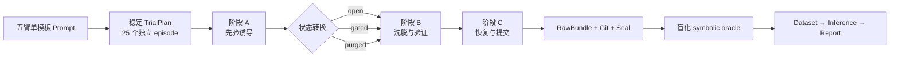

# 错误先验洗脱、记忆中介与证据门控实验

这个示例把 [`docs/plans/prior-washout-evidence-gating-study.md`](../../docs/plans/prior-washout-evidence-gating-study.md) 落成一个可运行的**确定性基础设施资格实验**。它用五个预注册实验臂、六个符号回归任务和三阶段协议，端到端检验 LLM Status Machine 当前的 Prompt、runtime、计划、调度、RawBundle、Git 快照、seal、盲化评分、episode 级数据集、统计推断、store 和 export 能力。

资格 Harness 不调用 LLM，而是产生固定的候选轨迹，因此运行结果只能证明软件链路能正确区分已知轨迹，不能证明真实模型存在错误先验持续、记忆中介或门控收益。真实 LLM pilot 必须在独立预注册后，把这个确定性替身换成会启动三个新鲜 CLI 进程的外部 orchestrator；当前 TrialPlan 没有 episode 内 stage schema，这个边界不会在示例里被掩盖。

## 实验设计

一个 episode 是一条完整的 A → B → C 轨迹，统计推断单位始终是 episode：



五臂为 `neutral-open`、`correct-open`、`false-open`、`false-gated` 和 `false-purged`。Prompt 都从 `prompts/prompt-template.md` 物化，只允许 `PRIOR` 与 `MEMORY` 两个标记区域不同。确认性资格计划使用 `seed=20260808`、`repeats=5`、`concurrency=1`、`state_policy=independent`，生成 25 个 episode；每个 arm 在 comparison set 的位置 1–5 各出现一次。

主要资格指标 IFO-AUC 是阶段 B/C 中仍落在已知错误候选上的比例。隐藏 scorer 还计算结构恢复率、远端 OOD-NMSE 和协议完整性。三个预注册 contrast 进入同一个 Holm family。固定轨迹应让 `false-open` 保持错误 motif，而 `false-gated` 和 `false-purged` 脱离；这是 scorer 与 inference 的 golden signal，不是待发表的模型效应。

## 一键资格测试

从仓库根目录运行：

```bash
uv sync --frozen --extra test --extra analysis
uv run python examples/prior-washout-evidence-gating-study/scripts/run_qualification.py \
  --root tmp/prior-washout-qualification
```

输出根必须尚不存在。脚本会依次执行：

- doctor、Harness list/probe/lock；
- fixture 生成、Prompt lint/freeze、workspace snapshot；
- Study validate/estimate/power、两次稳定编译与计划门禁；
- 25 个串行 independent custom-command episode；
- 每个 seal 验证、execution-integrity 与重复 blind command scoring；
- research dataset/infer/report；
- archive/JSONL/CSV export；
- index 备份后 reindex，以及前后 store verify；
- partial JSON、未知事件、非法 UTF-8、大流和 timeout recorder 资格场景。

最终入口是 `tmp/prior-washout-qualification/qualification-summary.json`。完整 run、RawBundle、评分和报告保留在同一临时根中，不提交 Git。

## 分步运行

如需观察每个 CLI 边界，可先锁定当前 Python 3.12 custom runtime：

```bash
PYTHON_BIN="$(uv run python -c 'import sys; print(sys.executable)')"
PYTHON_VERSION="$(uv run python -c 'import platform; print(platform.python_version())')"

uv run lsm harness lock \
  --surface custom_command \
  --executable "$PYTHON_BIN" \
  --version "$PYTHON_VERSION" \
  --output tmp/prior-washout-runtime.json

uv run python examples/prior-washout-evidence-gating-study/scripts/build_fixture.py
uv run python examples/prior-washout-evidence-gating-study/scripts/prepare_study.py \
  --runtime tmp/prior-washout-runtime.json \
  --output tmp/prior-washout-study.yml
uv run lsm study compile tmp/prior-washout-study.yml tmp/prior-washout-plan.jsonl --json
uv run python examples/prior-washout-evidence-gating-study/scripts/verify_plan.py \
  tmp/prior-washout-plan.jsonl
uv run lsm run start tmp/prior-washout-plan.jsonl \
  --data-root tmp/prior-washout-data --json
```

随后使用输出的 `run_id` 执行 `lsm evaluate run`、`lsm research dataset`、`lsm research infer` 和 `lsm research report`。一键脚本是这组命令的可审查实现。

## 数据与安全边界

- episode workspace 只包含训练/验证观测和 AST 白名单 evaluator；结构真值与 OOD 点只作为 pinned scorer support file，在运行结束后的只读 sealed snapshot 评分阶段提供。
- expression grammar 只允许有界数字、`x`、算术运算和 `sin/cos/exp/log`；同时限制文本长度、AST 节点数与常数幂指数，拒绝属性访问、导入、下标、反射、任意调用和明显的资源耗尽表达式。
- `symbolic_oracle` 设置 `include_prompt: false`，评分 manifest 不接收 arm、condition、ordinal 或 Prompt；评分程序只读 sealed final commit，并在评分后复核 workspace digest。
- `.lsm/`、runtime lock、RawBundle、导出、凭据和本地结果默认忽略。不要把 `auth.json`、`config.toml`、API key 或 Cookie 放进示例目录。
- 资格 runner 内置答案是显式的 trusted infrastructure test double。`custom_command` 当前不提供网络或 OS 权限沙箱，因此资格 profile 如实记录 `network=inherit`；脚本自身不执行网络操作。真实模型 pilot 不得使用它，也不得把其固定 effect 当作先验研究证据。

## 主要功能覆盖

| 能力 | 资格证据 |
| --- | --- |
| Prompt lint/render/freeze | 单模板物化五臂，规范化摘要一致，冻结文件有 SHA-256 |
| Harness/runtime | custom surface 可发现；Python 绝对路径、版本、platform 与 digest 锁定 |
| Workspace | 编译时 baseline、每 episode initial/final manifest、Git commit、changed files、diff |
| Study | validate、estimate、power、稳定 JSONL compile、平衡随机化 provenance |
| Run | 25 个串行 independent episode，planned/actual dispatch 可核对 |
| Recording | JSONL event、raw stdout/stderr、artifact、四类 outcome、失败与 timeout seal |
| Evaluation | execution-integrity + prompt-blind pinned command scorer，各重复两次 |
| Research | 一行一个 episode、三个预注册 contrast、bootstrap、置换检验、Holm、报告 |
| Store/export | seal verify、可重建 SQLite index、archive/JSONL/CSV |

## 目录

```text
fixture/                 可复制 workspace、可见数据、公开 evaluator、资格 runner
harness/                 真实 nested runtime 的本地锁模板（不含凭据）
oracle_tests/            模型不可见的 OOD/结构真值与 command scorer
prompts/                 单模板与五个物化 Prompt
scripts/                 fixture、StudySpec、计划门禁、recorder 与一键资格脚本
results/                 只允许未来提交脱敏 episode 级结果
```

## 真实 LLM pilot 的停止门禁

真实 pilot 前必须另行完成：锁定 nested Codex/Claude build 与模型端点；让外部 orchestrator 真正启动三个互不复用 session 的进程；验证阶段 B/C Prompt 不含阶段 A 先验；证明 gate/purge 的删除不可从残留文件恢复；冻结候选预算、timeout、MDE 和失败策略。未满足这些条件时，本示例保持“基础设施资格实验”标签。
