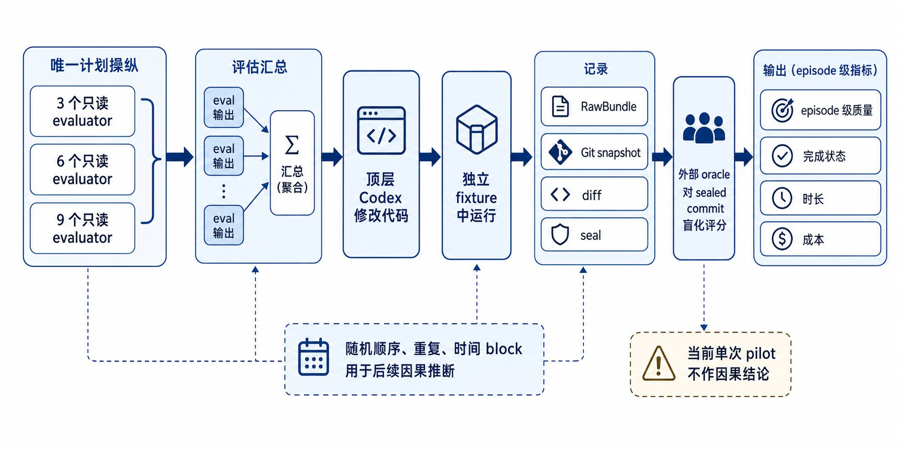
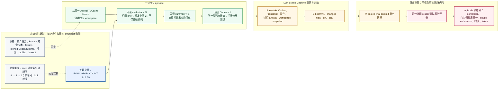

# 评估类 subagent 数量与软件开发质量

这个示例把一次真实的软件开发 agent 运行当作一个 **episode**，比较同一 Codex 工作流在 3、6、9 个只读评估类 subagent 条件下的端到端表现。三个 episode 都从同一个 `AsyncTTLCache` starter workspace 的独立副本开始；评估结束后，恰好一个总结 subagent 汇总发现，顶层 Codex 是唯一允许修改产品代码和运行公开测试的主体。

它测试的不是抽象的“模型智商”，而是一个可复现的 LLM agent 系统在固定任务和运行条件下的**可观察行为**：它能否交付、最终代码是否满足隐藏验收、耗时与 token 消耗如何，以及它留下的过程证据是否完整。这样定义实验单位，才能把模型、Prompt、Harness、runtime、workspace 和结果评分放在同一条可审计链路上。

## 原理图



上图是本示例的静态概览图：左起依次表示唯一计划操纵、评估汇总、顶层 Codex、过程记录、外部盲化评分与 episode 级指标。图中独立 fixture 放在顶层 Codex 旁，用来强调所有 agent 操作都发生在隔离副本中；实际时序是先复制 fixture，再启动 evaluator。下方的 Mermaid 图保留为可在 Git 中审阅、修改的结构化版本。



图中的实线是一次 episode 的执行与证据链；虚线表示设计层面的控制或随机化安排。`N` 是本实验唯一有意改变的流程参数：它同时改变收到的评审视角数和相应协调、等待、token 预算，因此结果应解释为“更多 evaluator 及其附带开销”的**条件效应**，而不是纯粹的数量效应。

## 这个测试究竟在比较什么

| 层次 | 固定或测量的内容 | 目的 |
|---|---|---|
| 处理变量 | `EVALUATOR_COUNT = 3 / 6 / 9` | 让每个条件只有一个预先声明的 Prompt 差异。 |
| 受控条件 | 同一 fixture、任务、模型、pinned runtime、执行 profile、timeout 与 evaluator brief | 减少其他系统条件带来的差异。 |
| 执行协议 | evaluator 只读；最多同时 2 个；1 个只读 summary；1 个顶层执行者 | 让“增加 subagent”有明确、可核对的含义，而不是让不同条件使用不同的开发团队。 |
| 实验单位 | 一个完整 episode，不是一个 subagent、测试用例或发现条目 | 防止把同一次协作中的相关结果误当成独立样本。 |
| 结果测量 | 完成状态、门禁调整质量分、隐藏 oracle 分、时长、token 与协议证据 | 同时观察正确性、交付可靠性和代价。 |
| 证据保全 | RawBundle、workspace snapshot、Git commit、diff、seal | 允许之后复核“模型做了什么”和“评分的到底是哪一版代码”。 |

## 为什么它可以测试 LLM

LLM agent 的输出不是一个静态答案：它会读取文件、调用工具、决定是否启用 subagent、修改代码、运行测试，并可能超时或中断。因此只比较最终自然语言答复，无法检验一个开发工作流是否真正可靠。这个示例通过以下闭环把 LLM 行为变成可测对象：

- **施加可重复的输入与条件。** `prepare_study.py` 从同一模板物化 3、6、9 三份 Prompt，并验证除了 `EVALUATOR_COUNT` 以外文本一致；每次都使用独立 workspace，避免上一 episode 的文件状态污染下一次。
- **运行真实 agent，而不是模拟分数。** TrialPlan 固定 Harness surface、Codex build、模型端点和执行 profile；`lsm run start` 实际启动 episode，LLM 的工具调用、协作选择、错误和超时都会成为结果的一部分。
- **把过程约束也变成可验证数据。** Prompt 要求保留 evaluator、summary 和 manifest。`score_run.py` 会核对 requested/completed evaluator 数、summary 数与 executor 数，因而可以发现“最终代码看似正确但没有按实验协议执行”的情况。
- **使用独立的结果判定。** 隐藏 oracle 不让 episode 预先看到；评分程序从 `workspace.final.json` 指向的 sealed Git commit 导出临时快照后才运行测试，不读取可能已被后续修改的现场 workspace。这减少了模型为迎合可见测试而非满足真实契约的风险。
- **保留失败而不只挑选成功。** 主质量分要求 episode 端到端 `completed`；超时或失败记为 0，即使最终目录里碰巧已有部分正确代码。这样测得的是可交付的 agent 行为，而非只在成功样本中比较代码。

因此，实验回答的形式是：**在这里冻结的任务、运行时和预算下，把只读评审 subagent 从 3 增至 6 或 9，整个 LLM 开发系统的交付质量、可靠性和成本如何变化？** 它不能直接证明某个基础模型在所有任务上“更聪明”，也不能把结果推广到不同模型、不同 Harness 或不同类型的代码任务。

## 一次 episode 如何运行

1. 生成 StudySpec，并把三种 evaluator 数量的 Prompt 编译为不可变 JSONL TrialPlan。
2. 为当前 trial 复制干净的 `fixture/`；LLM 只能在该 episode 的 workspace 内工作。
3. 顶层 Codex 按 Prompt 先启动恰好 `N` 个只读 evaluator（最多两个并行），再启动一个只读 summary。
4. 顶层 Codex 根据 summary 独自修复 `AsyncTTLCache`，运行可见的公开测试，并结束 episode。
5. LLM Status Machine 保存 transcript、stdout/stderr、event、workspace 初末快照、Git commit、diff、artifact 和 seal。
6. 外部评分程序先验证 seal，再从最终 commit 导出临时快照，运行同一套不可见 oracle 测试，最后才把盲化分数关联回 3/6/9 条件。

这里的顺序很重要：模型在运行时不能根据 oracle 反向调参；评分程序在盲化阶段也不应先读 treatment。两者共同降低了“结果由现场残留或人工主观判断决定”的风险。

## 如何读分数与证据

主指标是交付门禁调整后的 100 分质量分：只有 episode 端到端 `completed` 才保留 oracle code score，超时或失败记 0。未调整的 `oracle_code_score` 同时保留，用来区分“代码产物正确”与“软件交付完成”。例如一个 episode 可能已写出能通过 oracle 的 commit，却在 summary、记录或终态协议上超时；此时 oracle 分仍有诊断价值，但主指标为 0，因为用户无法获得完整、可审计的交付。

`score_run.py` 从 sealed `workspace.final.json` 指定的 Git commit 导出临时快照，并逐文件核对内容后评分，不读取可变现场代码。`pilot.csv` 是 episode 级 tidy 数据；`pilot.manifest.json` 进一步保留 scorer 版本、bundle digest、sealed workspace digest、实际被评分的 commit/content digest 和逐测试证据。若需要复查异常结果，应先检查 RawBundle 中的 transcript、manifest、seal 和 diff，再解读分数。

## 当前 pilot 能说明什么，不能说明什么

本轮是每个条件一次的描述性 pilot，不足以估计稳定趋势或统计显著性。已完成的 pilot 恰好按 3 → 6 → 9 固定升序运行，数量效应与顺序、时间漂移及 API 状态完全混杂；它的主要价值是展示 Prompt、pinned runtime、TrialPlan、真实模型执行、RawBundle、workspace diff、seal、外部盲化评分和 R Markdown 分析如何串成一条可审计链路。

后续重新生成计划时使用预注册 seed `20260810`，执行顺序为 9 → 3 → 6，避免再次采用单调顺序。要得到初步的比较证据，应在冻结方案后按时间 block 轮换条件、每个条件至少运行 3 个独立 episode，并保留所有失败和 requested count 的 intention-to-treat 分组。即使这样，结论仍限于本机、当前 Codex build、当前模型和该 `AsyncTTLCache` 任务；要讨论更一般的 LLM 行为，还需要跨任务、跨时间窗和跨模型重复。

## 安全边界

- 仓库内不复制、不软链接、不读取或输出 `config.toml` 与 `auth.json`。
- 运行时只通过外部 `CODEX_HOME` 继承现有 Codex 配置；StudySpec 和 RawBundle 只记录变量名，不记录值。
- 本目录的 `.gitignore` 防御性忽略误放的 `.codex/`、`auth.json`、`config.toml`、本地 `.lsm/` 和导出包。
- RawBundle 可能包含模型输出和代码，应按本地实验数据管理；默认不提交、不上传。

## 目录

```text
fixture/                 被三个 episode 独立复制的 starter 软件
oracle_tests/            episode 看不到的外部验收程序
prompts/                 单一模板与 3/6/9 三个物化 Prompt
scripts/prepare_study.py 生成并校验本地 StudySpec
scripts/score_run.py     对 sealed final workspace 盲化评分
analysis/                R + Rmd 可复现分析
results/                 可提交的脱敏 tidy 结果与摘要
.lsm/                    本地 TrialPlan、run 与 RawBundle，已忽略
```

## 运行

以下命令从仓库根目录执行。`CODEX_HOME` 应指向已经可用的外部 Codex 配置目录；不要把其中内容复制到本示例。

```bash
export CODEX_HOME="${CODEX_HOME:-$HOME/.codex}"

uv run lsm harness lock \
  --surface codex_exec_cli \
  --executable "$(command -v codex)" \
  --version 0.144.0 \
  --output examples/subagent-count-quality-study/.lsm/runtime.json

uv run python examples/subagent-count-quality-study/scripts/prepare_study.py \
  --runtime examples/subagent-count-quality-study/.lsm/runtime.json \
  --output examples/subagent-count-quality-study/.lsm/study.pilot.yml

uv run lsm study validate examples/subagent-count-quality-study/.lsm/study.pilot.yml --json
uv run lsm study compile \
  examples/subagent-count-quality-study/.lsm/study.pilot.yml \
  examples/subagent-count-quality-study/.lsm/plan.pilot.jsonl --json
uv run python examples/subagent-count-quality-study/scripts/verify_plan.py \
  examples/subagent-count-quality-study/.lsm/plan.pilot.jsonl
uv run lsm run start \
  examples/subagent-count-quality-study/.lsm/plan.pilot.jsonl \
  --data-root examples/subagent-count-quality-study/.lsm --json

uv run python examples/subagent-count-quality-study/scripts/score_run.py \
  --data-root examples/subagent-count-quality-study/.lsm \
  --output examples/subagent-count-quality-study/results/pilot.csv
```

分析脚本从 `results/pilot.csv` 生成完整 RDS、PDF 图和 Rmd 报告：

```bash
cd examples/subagent-count-quality-study/analysis
Rscript quality_analysis.R
Rscript -e 'rmarkdown::render("quality_analysis.Rmd")'
```

## 解释边界

主指标是交付门禁调整后的 100 分质量分：只有 episode 端到端 `completed` 才保留 oracle code score，超时或失败记 0；未调整的 `oracle_code_score` 同时保留，用来区分“代码产物正确”与“软件交付完成”。scorer 从 sealed `workspace.final.json` 指定的 Git commit 导出临时快照，并逐文件核对内容后评分，不读取可变现场代码。episode 是统计单位，subagent、测试用例和发现条目都不是独立样本。评估数量增加同时增加计算成本，因此本示例观察的是“更多评估 agent 及其附带预算”的总效果，不能分离纯数量效应；现有 pilot 还不能把 9-evaluator 的超时归因于数量。若要做初步重复研究，可在冻结本方案后按时间 block 轮换顺序、把每臂扩展为至少 3 个 episode，并保留原始失败及 requested count 的 intention-to-treat 分组。
